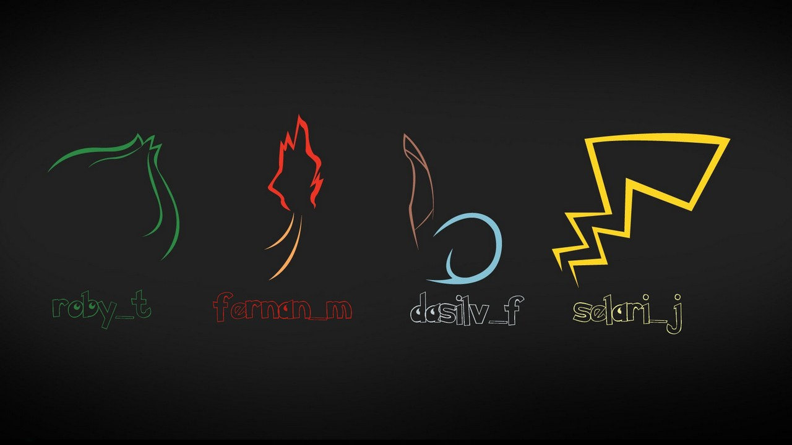
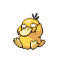
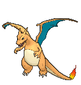
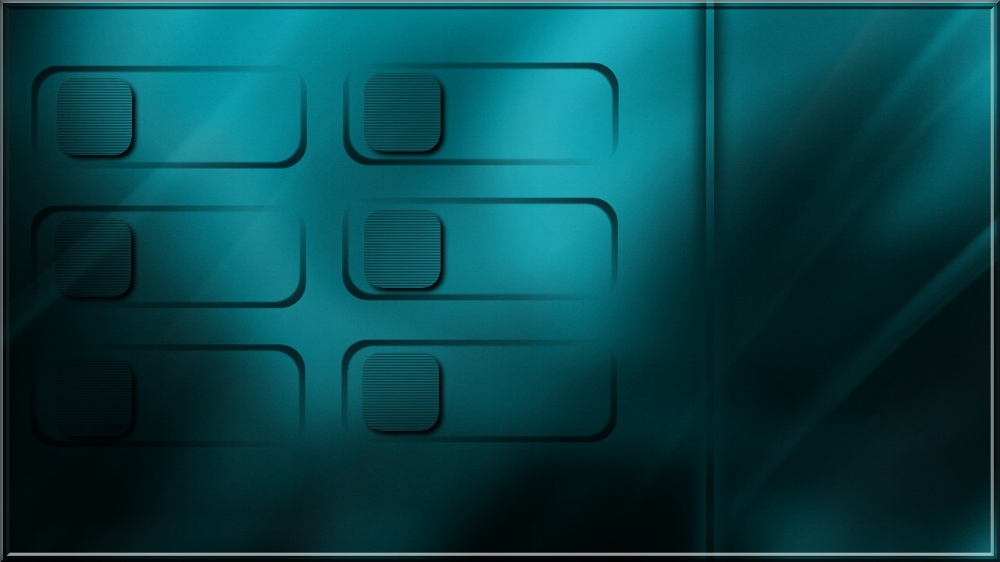

# Pokedex
First C++ Project  (eyes might burn) after 2week formation (2014)

# Graphic Lib : SFML 2.2  
-------------------------------------------------
 * Install : https://www.sfml-dev.org/download/sfml/2.2/
 * Tuto : https://www.sfml-dev.org/tutorials/2.2/
 * Tips : GL HF (ノಠ益ಠ)ノ
-------------------------------------------------

1. LOCATION : "./rendu/"
2. BUILD : make re 
3. LAUNCH : ./Pokedex
4. DEVICES : Keyboard Only

Infos : 
- Stats
- ""Gifs""
- Sounds
- Infos, Lore, Capacity, Category
- Pokedex - List +700 Pokemon
-------------------------------------------------

# Team Builder 
-------------------------------------------------

